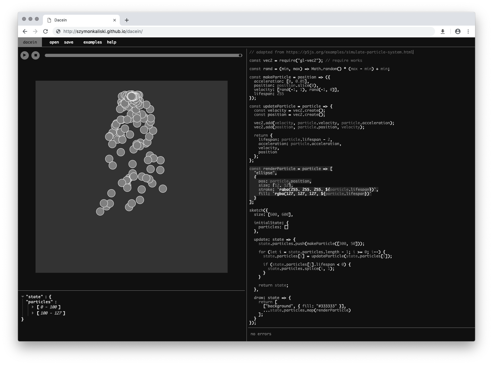

# Dacein

An experimental creative coding IDE combining:

- functional creative coding library
- time travel abilities
- livecoding editor
- direct manipulation

Live: [https://szymonkaliski.github.io/dacein/](https://szymonkaliski.github.io/dacein/)

You can check out lenghty blog post about why, how it was made here: [building dacein](http://szymonkaliski.com/log/2019-03-01-building-dacein/)

## Run

1. clone this repo
2. `npm install`
3. `npm start`

